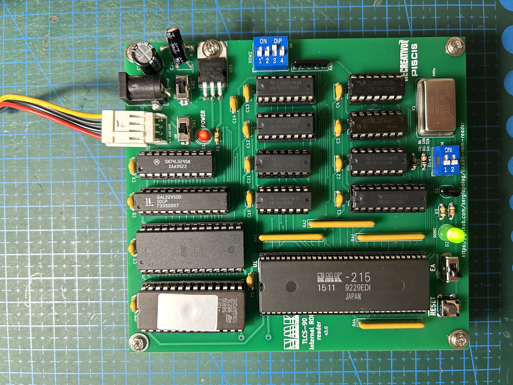
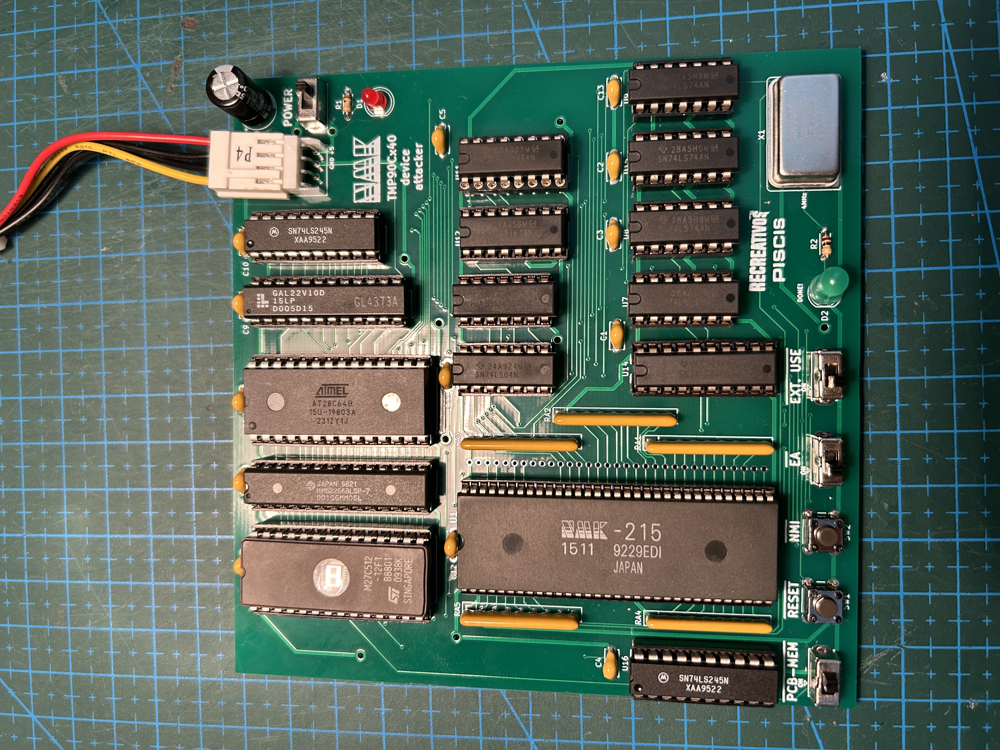
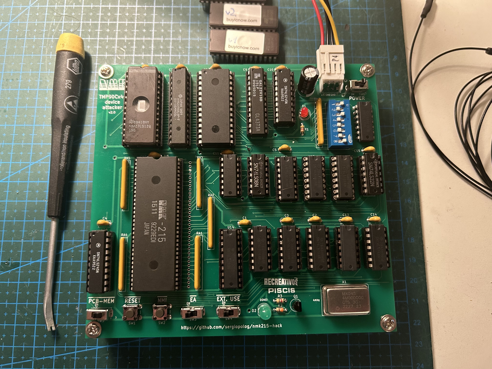
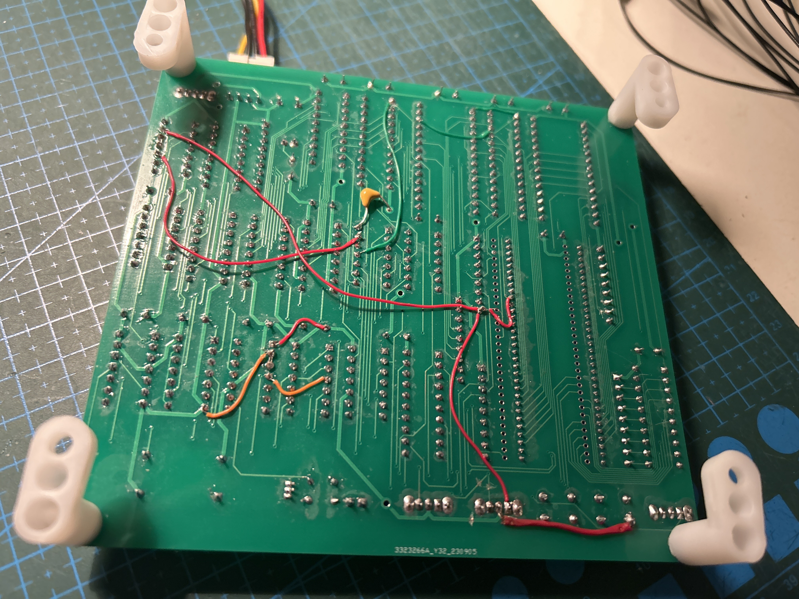

# TLCS-90 Internal ROM Reader Tool

TLCS-90 ROM Reader is custom made tool intended to read the inner ROM content that TLCS-90 series Toshiba MCUs have internally, at least for the models which support it.

[

](img/mcu-nmk215.jpeg)

Devices in the TLCS-90 family from Toshiba are MCUs with a Z80 core and a quite similar instruction set, but they have additional features than the original CPU from Zilog, such us:
  - Internal Counters
  - Wathdog
  - A/D converters
  - Serial port support
  - Stepping motors support
  - and more...
  
There are also devices in the family which have some space reserved for Internal ROM and RAM in their memory map, allowing to have an entire microcomputer system in a single chip (program code and work RAM could be included inside the chip).

## Where it started

Motivation of doing this started some years ago when I sourced a pcb of the GunNail arcade game from NMK (1992) in a very bad condition, including lot of rust and rotten components and traces.
Some the chips included in that pcb were very clearly faulty, with broken legs and serious damage. One of them is labeled as NMK-215, a supposedly custom-chip made by NMK back then with custom behavior, as its name already says.
After some investigation, I realized that component is in fact a Toshiba MCU, because the pinout matches with one of the models of those series as shown on their databook, at least the power pins (Vcc and Ground), reset, clock, address and data buses.
Those types of MCU, as said above, could have internal ROM, where it stores a program to be executed by the MCU itself. And that's probably the case for that NMK board.

Then, the first attempt to read if the internal ROM was in a phisical way. I sent the chip to [Furrtek](http://furrtek.free.fr) a while back to be decapped and, in a luckly chance, the ROM could be optically reed from the die, but there was no luck on that shot. The die reveals no visible ROM area, at least from the top view, ~~and a delayering (quite more complex method) should be performed to check if the ROM area will be visible underneath the top metal layer.~~ -> Thanks to [Travis Goodspeed](https://x.com/travisgoodspeed) for pointing out that TLCS-47 series has _Implant ROM_ (Toshiba most likely used the same technology for newer TLCS-90 series) meaning that the difference between P and N silicon describes the bit and, in fact, it's not optically visible  even after delayering, because they are the exact same color.

So, after that try, the next efforts were spent on trying to find a way to exploit the device and read the contents from outside using some external process,  like the way some other MCU devices were successfully dumped.

And that's how this project started. After 3 diferent revisions of the pcb and software made during the process in order to know how the MCU behaves in different scenarios and many of its features, it works for a good number of devices tested by now.

The internal ROMs dumped from several devices helped in improving and even managing to complete emulation on some games in MAME.

## TLCS-90 Series MCUs

| ROM | RAM | CMOS MASK ROM MCU | CMOS NO ROM | PROM MCU   | RESET PIN | SUPPORTED BY THE READER |
| --- | --- | ----------------- | ----------- | ---------- | --------- | --------- |
|  -  |  -  |  -                | TMP90C041N  |  -         | 22        | (not needed) |
|  -  |  1K |  -                | TMP90C141N  |  -         | 22        | (not needed) |
| 4K  | 128 | TMP90C400N        | TMP90C401N  | TMP90P800N | 35        | YES (using adapter) |
| 8K  | 256 | TMP90C800N        | TMP90C801N  | TMP90P800N | 35        | YES (using adapter) |
| **8K**  | **256** | **TMP90C840AN**       | **TMP90C841AN** | **TMP91P640N** | **22**        | **YES**   |
| 8K  | 256 | TMP90C844AN       | TMP90C845AN | TMP90PH44N | 47        | NO        |
| 16K | 320 | TMP91C642AN       | -           | TMP91P642N | 46        | NO        |
| **16K** | **512** | **TMP91C640N**        | **TMP91C641N**  | **TMP91P640N** | **22**        | **YES**   |
| 16k | 512 | TMP90CH44N        | TMP90CH45N  | TMP90PH44N | 47        | NO        |
| **32K** | **1K**  | **TMP90CM40AN**       | **TMP90C141N**  | **TMP90PM40N** | **22**        | **YES** (not tested yet)  |

**Bold** ones have the same pinout as NMK-215.
Not supported ones have slighty different architecture, lacking of /NMI pin, making the Reader pcb not able to achieve the process.
The 400N and 800N ones are (theoretically) supported but a pinout adapter is needed to use them with Reader PCB. However, that is currently untested yet, as I couldn't source any device of those models to check them out.

The tool consists in a combination of a custom-made pcb, a program code written to be executed on the targeted MCU itself, a PLD and glue logic to make all things work together. The tool runs by itself without needing to attach it to another hardware or so, it only requires to be populated with the proper components and powered it using +5V. 

## DISCLAIMER
Any use of this project is under **your own responsibility**. **You** will be responsible of checking the proper installation and functionality of your board and the compatiblity of the chips **You** will insert into it. By using this project **You** will agree that I cannot be held responsible if it will destroy any of your devices, burn down your house or whatever.

Do **NOT** come to me for hand-holding using this. It is **NOT** a plug-and-play tool, and it is something I created for my own research and use, and I released in case someone might have an use for it.

## Assemble

All components used on the PCB design are "Through-Hole". That makes the assembly easier.

1. Build the pcb using the gerbers located in the [pcb/gerbers](pcb/gerbers) folder.
2. Burn the program code from the binary file located at [src](src) folder into a 27C512 EPROM.
3. Burn the PLD from the jedec file located at [pld](pld) folder into a GAL22V10 device.
4. Install all the components into the pcb. Sockets are recommended at least for MCU, EPROM, EEPROM and PLD devices. There is an interactive, html-based BOM file located at [pcb/bom](pcb/bom) which is useful when populating the board.

## How to use

> **IMPORTANT:** Ensure that device is one of the compatible models marked above before proceeding with the process. If the model is unknown, you can check if it is one of the directly supported models by checking the following things:
> * Pins 1 and 64 should be tied to Vcc in the original pcb where it was installed.
> * Pins 2 and 32 should be tied to GND in the original pcb where it was installed.
> * Pin 55 should be tied to Vcc (or to a pull-up resistor) if it uses internal ROM.
> * Additionally, Pin 21 could be tied to Vcc aswell, indicating that no external interrupt is used. However this doesn't happen always.

First of all, ensure the 28C256 EEPROM is unprotected. This type of device can be protected making that any write performed on the device will be rejected. So, you need to ensure always to "Off Protect" the device before installing it on the board. Don't do any other actions on the EEPROM other than de-protecting it before inserting it in the socket of the reader PCB. (Thanks **kuze** for discovering and testing this)

1. Set the `DSW2` with an initial value of **4** (0100).
2. Select the internal ROM size of the target device using `DSW1`. If device model is unknown, then select 32K option to perform a full read. Perhaps, some space should be discarded after reading process.
3. Set the `/EA` switch to the left position **(ON)** (external mode)
4. Turn the power on. There are two options for powering the board:
	- Via Mini-molex floppy drive connector directly from an ATX PSU or similar. In this case connect only the power connector to `J1` and use the `SW1` **only** to turn on the board. Ensure that left pin is +5V and two middle pins are GND. This is the standard pinout for this kind of connectors.
	- Via Barrel connector (**Tip Positive - Ring Negative!!**) up to 12V from an external PSU. In this case connect only the barrel connector to `J2` and use the `SW2` **only** to turn on the board. (It works fine with 9V and 12V external power supplies, but in case of 12V, installing a heatsink on `U15` - L7805 is highly recommended)
5. Push the `/RESET` button shortly and green LED at `D2` will turn on, marking the PCB is ready.
6. Toggle the `/EA` switch to the right position **(OFF)** (internal mode)
7. Push again the `/RESET` button to start the read process. Green LED turns off.
8. When green LED turns on again, the process ended successfully. Time spent in the read process depends on the MCU model and the size of its internal ROM. A 8K internal ROM takes about 55 seconds, 16K one about 110 seconds and 32K one about 220 seconds using a 4MHz XTAL on the PCB. It could be upgraded up to 10MHz (max freq. allowed by the MCU), in order to reduce those dump times, but that's not really needed.
9. The contents of the internal ROM are written to the EEPROM located at `U3`. Carefully extract it from the socket and read contents with a proper EPROM reader.

If the initial rom size was unknown and the model wasn't really a 32K device, some extra content was read by the process and was placed at the end of the dumped file. In that file could be some flag values at some specific addresses marking what is the real internal ROM size:
* If a **"3B"** value is located at `$2000`, then the internal ROM is only  8K an the content between `$2000 - $8000` in the dump file should be discarded.
* If a **"4B"** value is located at `$4000`, then the internal ROM is only 16K an the content between `$4000 - $8000` in the dump file should be discarded.
* If none of those values are present at those positions, then the dump is really 32K length and no content should be discarded.

> **NOTE:** If the green led doesn't turn on long after those estimated times, then it should be a problem in the read process. Please check the [Special cases](#special-cases) section.

Powering the board using Barrel Connector and an external 9V DC power supply (**Tip Positive!**):  
[

](img/Powered_by_Barrel_Connector.jpeg)

## How it works

### TLCS-90 features

The dump method implemented in this tool sits over these features/behaviors of the TCLS-90 MCUs:

* The MCU provides an input pin called `/EA` ("External Access") and when it's asserted (low level), the MCU ignores the internal ROM (and RAM) space and addresess it to the outside using the address port pins. When it's not asserted it uses the internal ROM placed on the beginning of the memory map ($0000 - $2000, $0000 - $4000.. etc, depending of the specific MCU model). So we can externally control if the MCU starts in external or internal mode.
* The `/EA` pin doesn't allow a hot-swap, when the MCU is running, and only sets the value when resetting the device.
* Like a plain Z80 cpu, the first instruction fetched after reset is on `$0000` address. If the internal mode is enabled, that fetch is done from the internal ROM.
* Reset process only clear values for a few registers in the MCU. These are the PC register, AF register pair and IFF flags. The rest of the registers remain unchanged from previous execution (if any), including SP (Stack Pointer)
* When resetting the device in internal mode, the Address pins are set as input port by default, and it should be configured as address pins programatically if desire.
* External interrupt handling is basically the same as a plain Z80, saving PC value and AF value into the stack and restore them after ending interrupt subroutine.

### Exploit

Considering that, this is basically how the dump method works:

1. Start the device in external mode and the program code puts an external address value into the Stack Point register (SP). Then, the program halt the device waiting for reset.
2. Manually toggle the /EA pin to switch to internal mode and then reset again.
3. As SP value remains unchanged after that reset, if any interrupt is asserted, the device will store the PC value and some others into the stack, that is currently now at external zone pointed by the previous SP value
4. Inmediatly right after that second reset is released, the pcb logic generates a pulse into the `/NMI` pin to send an (non-maskable) interrupt. The device doesn't have enough time to fetch firsts instructions at `$0000` (that would probably set the SP to its own value), and it goes to handle the interrupt.
5. Device stores the PC and other values into the stack, that is currently on external zone, but the Address Port is configured as input port right after reset, so it doesn't effectively output the address on the device address pins to store those values, but doesn't care, they will not be used.
6. After running the interrupt subroutine (tipycally, it simply returns the control without doing anything else related to outside), the PC value (and others) need to be returned back from stack, and the device tries to read them from the external zone.
7. The pcb logic, using the `/RD` pin to count each fetch, artificially sends a new convenient PC value, so now the PC in the device is pointing to the zone we want (external zone).
8. The device tries to fetch instruction from the new injected PC address value, but the Address Port still remains as an input port after reset, so it doesn't output the proper address value to fetch the instruction.
9. The pcb logic again, using the `/RD` pin to count the subsequent fetches, artificially sends a sequence of 6 bytes, conforming 2 instructions to be executed by the device. Those instructions were carefully chosen to enable the Address pin to act effectively as an address port (output).
10. Next instruction is fetched normally by the device using the address port on the next PC value, and then we finally gain control of the device.
11. Next step is initiallize the rest of the device registers and ports and run the custom program stored in the external EPROM
12. The MCU itself copies the internal rom content ($0000 to $1FFF, or to $3FFF, or to $7FFF) to the EEPROM (Non-volatile) installed in the PCB by running the program code in the EPROM.

### Attack Timing

Below picture shows the main signals involved in the attack and how they evolve during the attack process:

[

](img/tlcs90-attack-timing.jpg)

### Special cases

If the interrupt routine does one or more reads by addressing the external zone, prior to return the control, or it pushes/pops values from the stack during that interrupt subroutine (the stacks pointer still points to the external zone and it provokes writes/reads there), the counter on the PCB will be confused and won't inject the proper values at the proper times. So if the internal code does that, this method will not work with the initial configuration. Anyway, it's rare that the NMI routine does data fetches from the external zone.

In this case, a workaround could be effective. That is trying to locate where the interrupt subroutine ends and what is the first fetch from stack during RETI instruction to take the AF register and then PC register. By adjusting DSW2, substracting some units to the initial configured value, will delay the reads count in order to sync the time when RETI tries to fetch PC value from stack with the time the PCB logic injects it to the data bus (i.e.: 4 -> 2).

Another rare case that could happen is that RET instruction is used instead of RETI when ending the interrupt subroutine. The difference is that RET only does "POP PC" and RETI does both "POP AF" and then "POP PC", so there will be two less read cycles when returning from interrupt. That could be adjusted with the DSW2 by adding two units to the value configured there (i.e.: 4 -> 6) in order to sync the time when PC value is injected in the same way as the previous case.

In all of these rare cases, the way to go is playing with different values on the DSW2, by adding or substracting some units to the value configured in it until syncing the time when the new PC value should be injected.

Obviously, if the interrupt routine does many complex things, a custom solution should be made for attacking that specific device. A Logic Analyzer would be a great help to inspect what happens after the NMI pulse is generated by the reader PCB logic.

In a weird case, I discovered that one program has a direct jump on the interrupt subroutine, instead of the RETI instruction. In that case, the program jumped to remote program address (inside internal ROM) and continue executing instructions, until it calls to a subroutine. In that moment the value of the PC was stored in the stack (still pointing to external zone) and when the subroutine ended, the program tried to take the PC value back from the stack and at that point the new PC value was injected. In all of that execution time, no external fetches were done, so the first one was for returing back that PC value, and the new one was injected.

## Known TLCS-90 based devices

Below there is a table with the current known devices based on TLCS-90 series MCUs, model, features and if the contents are currently dumped, aswell.

|  Device Ref.  |  Device Model  |  Package  |  Dev. Company  |  Found on Hw  |  Dumped?  |  Config. used to dump (DSW2)  | Picture |
| --- | --- | ----------------- | ----------------- | ----------- | ----------- | ----------- | ----------- |
|  NMK-004  |  TMP90840  |  QFP64  |  NMK  |  many NMK games (sound cpu)  |  [**Yes**](https://github.com/mamedev/mame/blob/0006fba49565386afa9b66d9fb8e02f744cf7cdb/src/mame/nmk/nmk004.cpp#L83) (using [trap15 method](http://daifukkat.su/blog/archives/2014/09/13/nmk004_rom_dumping_part_5_the_release/)) Also dumped using **TLCS90-ROM-Reader** and adapter located at [adapter/tmp90c840-qfc2sdip](adapter/tmp90c840-qfc2sdip)  |  2  |  [Link](img/mcu-nmk004.jpeg)  |
|  NMK-110  |  TMP91640  |  SDIP64  |  NMK  |  ddealer & tdragon (different internal ROM on each one)  |  [**Yes**](https://github.com/mamedev/mame/blob/0006fba49565386afa9b66d9fb8e02f744cf7cdb/src/mame/nmk/ddealer.cpp#L463)  and  [**Yes**](https://github.com/mamedev/mame/blob/0006fba49565386afa9b66d9fb8e02f744cf7cdb/src/mame/nmk/nmk16.cpp#L6447)  |  4  |  [Link](img/mcu-nmk110.jpeg)  |
|  NMK-113  |  TMP91640  |  SDIP64  |  NMK  |  hachamf  |  [**Yes**](https://github.com/mamedev/mame/blob/0006fba49565386afa9b66d9fb8e02f744cf7cdb/src/mame/nmk/nmk16.cpp#L6801)  |  4  |  [Link](img/mcu-nmk113.jpeg)   |
|  NMK-215  |  TMP90840  |  SDIP64  |  NMK  |  sabotenb, bjtwin, macross, gunnail  |  [**Yes**](https://github.com/mamedev/mame/blob/0006fba49565386afa9b66d9fb8e02f744cf7cdb/src/mame/nmk/nmk16.cpp#L7480)  |  4  |  [Link](img/mcu-nmk215.jpeg)   |
|  -  |  TMP90840  |  SDIP64  |  Dynax  |  mjvegas  |  [**Yes**](https://github.com/mamedev/mame/blob/26072bb747281a3abb519dc2a2c38884b9c5d479/src/mame/dynax/royalmah.cpp#L5159)  |  2  |  [Link](img/mcu-mjvegas.jpeg)   |
|  -  |  TMP90840  |  SDIP64  |  Dynax  |  cafedoll  |  [**Yes**](https://github.com/mamedev/mame/blob/26072bb747281a3abb519dc2a2c38884b9c5d479/src/mame/dynax/royalmah.cpp#L5042)  |  2  |  [Link](img/mcu-cafedoll.jpeg)  |
|  -  |  TMP90840  |  SDIP64  |  Dynax  |  cafetime  |  [**Yes**](https://github.com/mamedev/mame/blob/26072bb747281a3abb519dc2a2c38884b9c5d479/src/mame/dynax/royalmah.cpp#L98)  |  2  |  [Link](img/mcu-cafetime.jpeg)  |
|  -  |  TMP91640  |  SDIP64  |  Dynax  |  cafebrk  |  [**Yes**](https://github.com/mamedev/mame/blob/26072bb747281a3abb519dc2a2c38884b9c5d479/src/mame/dynax/royalmah.cpp#L5340)  |  2  |  [Link](img/mcu-cafebrk.jpeg)  |
|  -  |  TMP91640  |  SDIP64  |  Dynax  |  cafepara |  [**Yes**](https://github.com/mamedev/mame/blob/26072bb747281a3abb519dc2a2c38884b9c5d479/src/mame/dynax/royalmah.cpp#L5072)  |  2  |  [Link](img/mcu-cafepara.jpeg)  |
|  -  |  TMP90840  |  SDIP64  |  Dynax  |  mjtensin  |  [**Yes**](https://github.com/mamedev/mame/blob/fe923e9b3c464d7e373dd1992c6001b47b572e19/src/mame/dynax/royalmah.cpp#L4868) *(not used by the game code)*  |  4  |  [Link](img/mcu-mjtensin.jpeg)  |
|  -  |  TMP91640  |  SDIP64  |  Dynax  |  majrjh  |  [**Yes**](https://github.com/mamedev/mame/blob/000c31fae55296ae3a853f2ffbe44a6d46dc7a3a/src/mame/dynax/royalmah.cpp#L4970)  |  2  |  [Link](img/mcu-majrjhdx.jpeg)  |
|  -  |  TMP91640  |  SDIP64  |  Dynax  |  majrjhdx  |  [**Yes**](https://github.com/mamedev/mame/blob/000c31fae55296ae3a853f2ffbe44a6d46dc7a3a/src/mame/dynax/royalmah.cpp#L4955) *(same dump as majrjh)*  |  2  |  [Link](img/mcu-majrjhdx.jpeg)  |
|  -  |  ?  |  SDIP64  |  Dynax  |  gekisha  |  No  |  -  |  -  |
|  -  |  TMP91640  |  SDIP64  |  Dynax  |  tenkai  |  [**Yes**](https://github.com/mamedev/mame/blob/88a47305a4a5987fbe0e9160d8dd6b6a9c3a2314/src/mame/dynax/dynax.cpp#L6820) *(already dumped previosly)* *(pending to be dumped using this method)*  |  -  |  -  |
|  -  |  ?  |  SDIP64  |  Dynax  |  tenkai2b  |  No  |  -  |  -  |
|  -  |  TMP90840  |  SDIP64  |  Dynax  |  ougonhai  |  [**Yes**](https://github.com/mamedev/mame/blob/fe923e9b3c464d7e373dd1992c6001b47b572e19/src/mame/dynax/dynax.cpp#L7021)  |  2  |  [Link](img/mcu-ougonhai.jpeg)   |
|  -  |  TMP90840  |  SDIP64  |  Dynax  |  mjreach  |  [**Yes**](https://github.com/mamedev/mame/blob/fe923e9b3c464d7e373dd1992c6001b47b572e19/src/mame/dynax/dynax.cpp#L6662)  |  2  |  [Link](img/mcu-mjreach.jpeg)   |
|  -  |  TMP90840  |  SDIP64  |  Dynax  |  mjreach2  |  [**Yes**](https://github.com/mamedev/mame/blob/3f9d6b905f18b8800a9420abdd981ee51502d85e/src/mame/dynax/dynax.cpp#L6751)  |  2  |  [Link](img/mcu-mjreach2.jpeg)   |
|  -  |  ?  |  SDIP64  |  Jaleco  |  avspirit  |  No  |  -  |  -  |
|  -  |  ?  |  SDIP64  |  Jaleco  |  edf  |  No  |  -  |  -  |
|  MO-91009  |  TMP91640  |  SDIP64  |  Jaleco  |  64street  |  [**Yes**](https://github.com/mamedev/mame/blob/7b047641fe763667882a8c3320ad24163c63d327/src/mame/jaleco/megasys1.cpp#L2297)  |  6  |  [Link](img/mcu-mo91009.jpeg)  |
|  MO-91021  |  TMP91640  |  SDIP64  |  Jaleco  |  bigstrik  |  [**Yes**](https://github.com/mamedev/mame/blob/7b047641fe763667882a8c3320ad24163c63d327/src/mame/jaleco/megasys1.cpp#L2879)  |  6  |  [Link](img/mcu-mo91021.jpeg)  |
|  MO-91028  |  TMP91640  |  SDIP64  |  Jaleco  |  chimerab |   [**Yes**](https://github.com/mamedev/mame/blob/7b047641fe763667882a8c3320ad24163c63d327/src/mame/jaleco/megasys1.cpp#L2927) *(same dump as cybattlr)* Thanks to **kuze**  |  6  |  [Link](img/mcu-mo91028.jpeg)  |
|  -  |  ?  |  SDIP64  |  Jaleco  |  chimeraba |  No  |  -  |  -  |
|  MO-91028  |  TMP91640  |  SDIP64  |  Jaleco  |  cybattlr  |   [**Yes**](https://github.com/mamedev/mame/blob/7b047641fe763667882a8c3320ad24163c63d327/src/mame/jaleco/megasys1.cpp#L3049) Thanks to **kuze**  |  6  |  [Link](img/mcu-mo91028.jpeg)  |
|  MO-91044  |  ?  |  SDIP64  |  Jaleco  |  hayaosi1  |  No  |  -  |  -  |
|  MO-92033  |  ?  |  SDIP64  |  Jaleco  |  peekaboo  |  No  |  -  |  -  |

If you find more devices based on this MCU series, have additional info or successfully dump some, please let me know to add them to the above table, just as reference. 

## Prototypes and previous versions

During the process some previous versions of the board was manufactured and tested, in order to understand the behaviour of the MCU in some special cases and test different attacks over it. 

### Version 1 (Proto - Test board)

This board was the first ever made and the purpose of that was testing the behaviour of the TLCS90 devices and perform some simple attack attempts and see how the device behaves under them.

[

](img/TLCS90-rom-reader-v1.jpg)

### Version 2 (Proto - Attack board)

Using the data compiled from the first version, the second one includes the implementation of the main attack with some small variants to be tested with real devices.

[

](img/TLCS90-rom-reader-v2-front.jpg)

Multiple patches needed to be done directly in the pcb in order to fix errors and test slight variations of the attack :D

[

](img/TLCS90-rom-reader-v2-back.jpeg)

### Version 3 (Final version)

After confirming the attack is successfull for several devices, the unused parts were removed and the layout was simplified. Added support for selecting the type of device (by its internal ROM size). Also an additional option to power the board via barrel connector was added. 

[

](img/mcu-nmk215.jpeg)

## Special Thanks

Special thanks to  [hammy](https://www.youtube.com/@HammyArcade) for his valuable help on the research of this project and helping in sourcing PCBs and TLCS90 devices for testing.

## Contact

[@Recre_Piscis](https://x.com/Recre_Piscis) on X (_Twitter_).

## License

See [LICENSE](LICENSE) for more details.
